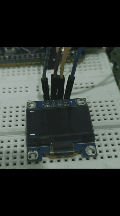

[](https://opensource.org/licenses/MIT)
[](https://www.st.com/en/microcontrollers-microprocessors/stm32f411.html)
[](https://en.wikipedia.org/wiki/I%C2%B2C)

A **from-scratch, register-level** I2C driver for SSD1306 OLED displays on STM32F411 Black Pill. No HAL.

## 🎯 Project Overview

Complete I2C master implementation driving a 128×64 SSD1306 OLED display using framebuffer architecture

## ✨ Features

✅ **Complete I2C Master Implementation**
- Manual register configuration (no HAL)
- START/STOP condition generation
- 7-bit addressing with ACK/NACK handling
- 100kHz Standard Mode

✅ **SSD1306 OLED Driver**
- Full initialization sequence (25 commands)
- Command/Data transmission protocol
- Horizontal addressing mode
- Charge pump configuration

✅ **Framebuffer Graphics System**
- 128×64 monochrome buffer (1024 bytes)
- Pixel-level drawing API
- Optimized burst transfer (1024 bytes in 1 I2C transaction)
- 100× faster than naive byte-by-byte approach

✅ **Graphics Primitives**
- `SSD1306_DrawPixel()` - Single pixel control
- Border drawing
- Diagonal line rendering
- Expandable architecture for text and shapes

<p align="center">
  
</p>
<p align="center"><em>Baremetal I2C Driver → STM32F103 → SSD1306 OLED (Auto-Looping)</em></p>

## 📊 Technical Specifications

| Component           | Specification                   |
|---------------------|---------------------------------|
| **MCU**             | STM32F411CEU6 (ARM Cortex-M4F)  |
| **Clock**           | 16 MHz HSI                      |
| **I2C Speed**       | 100 kHz (Standard Mode)         |
| **Display**         | SSD1306 0.96" OLED (128×64)     |
| **Protocol**        | I2C (7-bit addressing)          |
| **Transfer Mode**   | Burst (1024 bytes/transaction)  |
| **Performance**     | ~10ms full-screen refresh       |

## 🔧 Hardware Setup

### Pin Configuration

| STM32 Pin | Function | OLED Pin |
|-----------|----------|----------|
| **PB6**   | I2C1_SCL | SCL      |
| **PB7**   | I2C1_SDA | SDA      |
| **3.3V**  | Power    | VCC      |
| **GND**   | Ground   | GND      |


### Wiring

Black Pill ------------+-------+ SSD1306 OLED

| PB6 ----------------+-----------+ SCL |

| PB7 ----------------+-----------+ SDA |

| 3.3V --------------- +----------+ VCC  |

| GND ----------------+----------+ GND  |

## 🗺️ Framebuffer Memory Mapping (128×64 OLED)

The SSD1306 controller organizes its 1024-byte Graphics Display Data RAM (GDDRAM) into **8 horizontal pages**. Each page contains 128 bytes, where each byte represents a vertical column of 8 pixels.

| Page | Byte Range | Pixel Rows Covered |
| :---: | :--- | :--- |
| **Page 0** | Bytes 0 - 127 | Rows 0 - 7 |
| **Page 1** | Bytes 128 - 255 | Rows 8 - 15 |
| **Page 2** | Bytes 256 - 383 | Rows 16 - 23 |
| **Page 3** | Bytes 384 - 511 | Rows 24 - 31 |
| **Page 4** | Bytes 512 - 639 | Rows 32 - 39 |
| **Page 5** | Bytes 640 - 767 | Rows 40 - 47 |
| **Page 6** | Bytes 768 - 895 | Rows 48 - 55 |
| **Page 7** | Bytes 896 - 1023 | Rows 56 - 63 |

---

### 🎓 Key Learnings: Critical I2C Concepts

*  **Open-Drain is mandatory** 
    Prevents bus contention when multiple devices share the line.
*  **ADDR flag clearing trap** 
    Must read `SR1` then `SR2` to clear, otherwise the bus locks up.
*  **Address shifting** 
    7-bit address must be shifted left and OR'd with the R/W bit.
*  **Pull-up resistors** 
    Required for I2C idle state (internal or external).

### Framebuffer Memory Mapping

The 128×64 display is organized into **8 pages** (8 rows each):

- Page 0: Bytes 0-127 (Rows 0-7)
- Page 1: Bytes 128-255 (Rows 8-15)
- Page 2: Bytes 256-383 (Rows 16-23)
- Page 3: Bytes 384-511 (Rows 24-31)
- Page 4: Bytes 512-639 (Rows 32-39)
- Page 5: Bytes 640-767 (Rows 40-47)
- Page 6: Bytes 768-895 (Rows 48-55)
- Page 7: Bytes 896-1023 (Rows 56-63)
---

### 📐 Pixel Mapping Formula

To plot a single pixel at Cartesian coordinates `(x, y)`, you must calculate the correct byte index in the 1D buffer and the specific bit within that byte.

**The Formula:**
```c
uint16_t index = x + ((y / 8) * 128);
uint8_t bit_position = y % 8;

// To set the pixel (turn ON):
buffer[index] |= (1 << bit_position);
```
### Concrete Example: Pixel (50, 20)

* **Page:** `20 / 8 = 2`
* **Bit:** `20 % 8 = 4`
* **Index:** `50 + (2 × 128) = 306`
* **Location:** `Buffer[306]`, bit `4`

---

## 📟 SSD1306 Controller Commands

The following hex commands are sent over I2C (prefixed with the `0x00` control byte for command mode) to initialize and configure the SSD1306 display controller.

| Command | Hex Code | Description |
| :--- | :---: | :--- |
| **Display OFF** | `0xAE` | Turns off the OLED display panel. |
| **Display ON** | `0xAF` | Turns on the OLED display panel. |
| **Charge Pump** | `0x8D` | Enables the internal DC-DC charge pump (**Critical!** Required to generate the high voltage needed to light up the OLED pixels). |
| **Memory Mode** | `0x20` | Sets the memory addressing mode (e.g., Horizontal, Vertical, or Page addressing). |
| **Column Addr** | `0x21` | Sets the start and end column address range for GDDRAM writes. |
| **Page Addr** | `0x22` | Sets the start and end page address range for GDDRAM writes. |

---

## ⚠️ Common Pitfalls to be Avoided

When writing baremetal I2C drivers, hardware-level mistakes can cause silent failures or permanent bus lockups. Here are the critical issues handled in this implementation:

*  **Forgetting to clear the `ADDR` flag** → Causes permanent **bus lockup** (SCL held low indefinitely). *Fix: Read `SR1` then `SR2` sequentially.*
*  **Using Push-Pull instead of Open-Drain** → Causes **bus contention** and potential hardware damage. *Fix: Configure GPIO pins as Alternate Function Open-Drain.*
*  **Missing pull-up resistors** → Results in **floating bus lines** and failed communication. *Fix: Use external 4.7kΩ pull-ups to VCC.*
*  **Not waiting for the `TXE` (Transmit Data Register Empty) flag** → Causes **data corruption** or overwritten bytes. *Fix: Poll `I2C_SR1 & I2C_SR1_TXE` before writing to `I2C_DR`.*
*  **Wrong memory mapping (GDDRAM)** → Results in a **garbage display** or shifted graphics. *Fix: Strictly follow the `Page = y/8`, `Bit = y%8` mapping formula.*
---

## 📂 Project Structure

STM32-I2C-OLED-BareMetal/  
├── src/  
│   └── main.c                 # Main application, I2C driver, and graphics logic  
├── include/  
│   └── blackpill_stm32f411.h  # Direct hardware register definitions and memory maps  
└── README.md                  # Project documentation  

---
****🔗 Resources****

[STM32: Reference Manual] https://www.st.com/resource/en/reference_manual/rm0383-stm32f411xc-e-advanced-armbased-32bit-mcus-stmicroelectronics.pdf

[SSDOLED: Datasheet] https://cdn-shop.adafruit.com/datasheets/SSD1306.pdf?spm=a2ty_o01.29997173.0.0.794a55fb5y1dI0&file=SSD1306.pdf

[OLED UserGuide] https://www.nxp.com/docs/en/user-guide/UM10204.pdf?spm=a2ty_o01.29997173.0.0.794a55fb5y1dI0&file=UM10204.pdf


## 👨‍ Author

**Asif Ahamed S**

Final Year - Electronics & Communication Engineering

Rajalakshmi Engineering College, Thiruvallur

🔗 LinkedIn: linkedin.com/in/asif-ahamed-s-ece

📧 Email: asifahamed670@gmail.com
